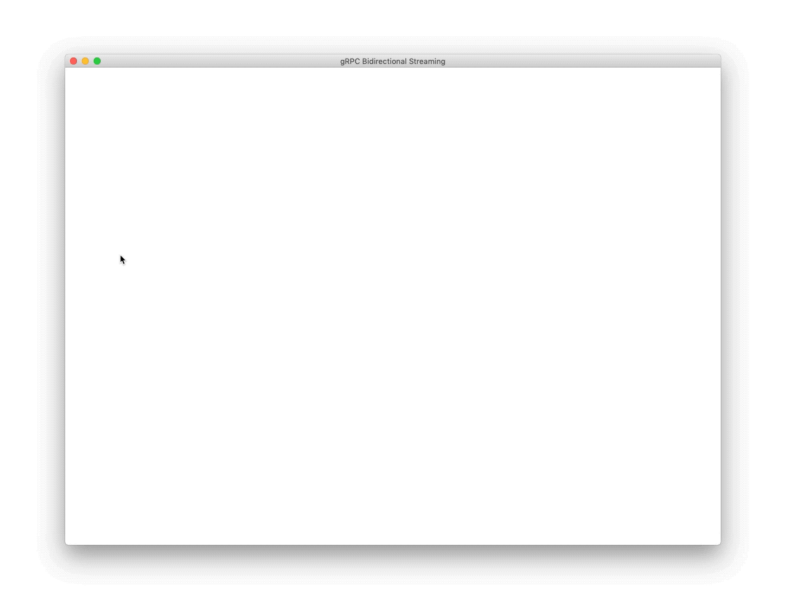

# gRPC Demo

Leverage gRPC's powerful bidirectional streaming capabilities with a simple Python drawing app and GoLang backend service.



The front-end Python application streams the mouse X and Y coordinates via gRPC to the backend `transform` service, which flips the coordinates along a horizontal axis, and streams them back to the front end service to be displayed.

The contract between services is defined in the `demo.proto` file, with `flip` being the lone RPC call, that both _receives_ and _returns_ a gRPC stream of `Point` messages.

```proto
service Transform {
	rpc flip(stream Point) returns (stream Point) {}
}

message Point {
	double x = 1;
	double y = 2;
	Canvas canvas = 3;
}

message Canvas {
	int64 width = 1;
	int64 height = 2;
}
```

The `Point` message is received by the backend `transform` service, which flips the X and Y values along the horizontal axis.

```go
func (s *Server) Flip(stream pb.Transform_FlipServer) error {

    for {

        in, err := stream.Recv()

        if err != nil {
            return err
        }

        if (in.X >= 0) && (in.Y >= 0) {

            out := gfx.Mirror(in)
            err := stream.Send(&out)

            if err != nil {
                return err
            }
        }
    }
}
```

On mouse-down, the front-end Python application draws a line from the user's previous mouse location to its current mouse location, and sends the current mouse location the backend to the `transform` service, and draws a line from the previous mirror point to the current mirror point.

```python
for flip_point in stub.flip(send([event_point])):
    if len(flip_points) > 1:
        draw_line(flip_points[-2],flip_points[-1])
    flip_points.append(flip_point)
```

---

&nbsp;

## Build & Run Instructions

From the `/transform` directory, pull all dependencies.

```bash
$ go get
```

Serve up transform service on `:9901`

```bash
$ go run server.go
```

From the `/draw` directory, run `pip install grpcio`. Then start up the application:

```bash
$ python main.py
```

---

&nbsp;

## Compililing Protos

Go

```bash
$ protoc -I . demo.proto --go_out=plugins=grpc:transform/protos/
```

Python

```bash
$ python -m grpc_tools.protoc -I . demo.proto --python_out=draw/protos/ --grpc_python_out=draw/protos/
```

---

&nbsp;

## Maintainers

| Name            | Email                   |
| :-------------- | :---------------------- |
| Michael Edenzon |                         |
